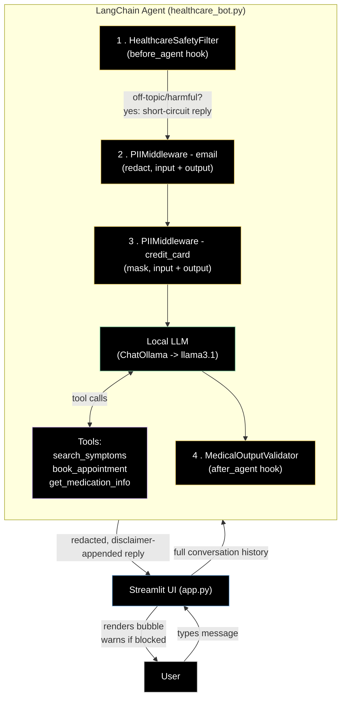

# 🩺 Healthcare Assistant Chatbot

A guardrailed, locally-run healthcare information chatbot built with **LangChain agent middleware**, **LangGraph**, and a **Streamlit** chat UI. The assistant answers general health questions, looks up symptom/medication information, and can "book" appointments — while enforcing safety, privacy, and disclaimer guardrails on every turn.

Runs entirely **on-device** using a local Llama model served via [Ollama](https://ollama.com) — no data leaves your machine, no external API key required.

---

## Summary

| | |
|---|---|
| **UI** | Streamlit chat interface |
| **Agent framework** | LangChain `create_agent` (LangGraph under the hood) |
| **Model** | Local Llama 3.1 (via Ollama) — swappable for any LangChain chat model |
| **Guardrails** | Off-topic/harm filter · PII redaction (input **and** output) · Mandatory medical disclaimer |
| **Tools** | Symptom lookup, medication info, appointment booking (mocked) |

This project is a reference implementation of a **defense-in-depth guardrail pattern** for healthcare chatbots: every message is checked *before* it reaches the model, and every response is checked *before* it reaches the user.

---

## Architecture



**Guardrail flow, step by step:**

1. **`HealthcareSafetyFilter`** inspects the incoming message for blocked topics (self-harm, weapons, hacking, etc.). If matched, it short-circuits the whole graph and returns a fixed safe-redirect message — the model is never called.
2. **`PIIMiddleware` (email)** and **`PIIMiddleware` (credit_card)** scan and sanitize both the *input* going into the model and the *output* coming back from it, so PII is scrubbed on the way in and can't leak back out even if the model echoes it.
3. The **local LLM** (Llama 3.1 via Ollama) processes the sanitized conversation and may call one of the registered **tools**.
4. **`MedicalOutputValidator`** checks the final response and appends a medical disclaimer if one isn't already present.
5. The **Streamlit UI** renders the final message — using a distinct "warning" style if the safety filter blocked the request.

---

## Code walkthrough

### `healthcare_bot.py` — the agent

- **`HealthcareSafetyFilter`** *(`AgentMiddleware`)* — a `before_agent` hook that checks the **first** human message in the conversation against a keyword blocklist. On a match, it returns a fixed safety message and jumps straight to `"end"`, skipping the model call entirely.
- **`MedicalOutputValidator`** *(`AgentMiddleware`)* — an `after_agent` hook that inspects the final `AIMessage` and appends a standard disclaimer if the response doesn't already mention "medical advice."
- **Tools** (`search_symptoms`, `book_appointment`, `get_medication_info`) — plain `@tool`-decorated functions. In this reference version they return mocked/static responses; swap in real EHR/scheduling API calls for production use.
- **`local_llm`** — a `ChatOllama` instance pointing at your local Ollama server (`http://localhost:11434`), running `llama3.1`. Swap this for `ChatOpenAI`, `ChatAnthropic`, etc. if you want a hosted model instead — the rest of the agent code doesn't need to change.
- **`create_agent(...)`** — wires the model, tools, and middleware stack together into a runnable LangGraph agent. Middleware order matters: safety filtering runs first, then PII sanitization, then the model/tools, then disclaimer validation on the way out.

### `app.py` — the Streamlit UI

- Imports the compiled `healthcare_bot` agent from `healthcare_bot.py`.
- Maintains conversation history in `st.session_state.messages`.
- On each user turn:
  1. Sends the **full conversation history** to `agent.invoke(...)` (the agent graph itself has no persistent memory between calls).
  2. Pulls the **redacted version** of the user's own message back out of the agent's returned state — so the UI (and session memory) reflects what was actually sanitized, not the raw text typed. This avoids keeping unredacted PII in memory anywhere in the app.
  3. Displays the assistant's reply, using `st.warning(...)` instead of a normal bubble if the safety filter's block message is detected — making refused requests visually distinct.
- Sidebar lists the active guardrails and includes a "New conversation" reset button.

---

## Setup

```bash
# 1. Clone and enter the repo
git clone https://github.com/poreddy7879/AI_security.git
cd healthcare_app

# 2. Create a virtual environment
python -m venv venv
source venv/bin/activate      # Windows: venv\Scripts\activate

# 3. Install dependencies
pip install -r requirements.txt

# 4. Install Ollama and pull a local model
brew install ollama            # or https://ollama.com
ollama serve
ollama pull llama3.1

# 5. Run the app
streamlit run app.py
```

No `.env`/API key is required for the default local-model setup. If you swap `local_llm` for a hosted provider (OpenAI, Anthropic, etc.), you'll need to add the relevant API key via a `.env` file and `python-dotenv` (already wired up at the top of `healthcare_bot.py`).

---
Homescreen screenshot:


General Health Query response:


Off-topic/security filter type question:


Email Redact for input filter:


## Known limitations / roadmap

- **`HealthcareSafetyFilter` only inspects the *first* message of a conversation.** A harmful or off-topic request sent on turn 2+ currently isn't caught. This should be changed to check the latest human message on every turn before production use.
- **Tools are mocked.** `book_appointment`, `search_symptoms`, and `get_medication_info` return static strings — they're stand-ins for real scheduling/EHR/drug-database integrations.
- **Blocklist-based safety filtering is keyword-based**, not semantic — easy to bypass with paraphrasing. Consider a classifier-based or LLM-based moderation layer for production.
- **No authentication/user identity** — the UI is single-session and doesn't distinguish between users or persist history across browser sessions.

---

## Disclaimer

This project is a **reference/demo implementation** and is not a certified medical device or HIPAA-compliant system as-is. Do not use it to provide real medical advice or store real patient data without a full security, privacy, and compliance review.
